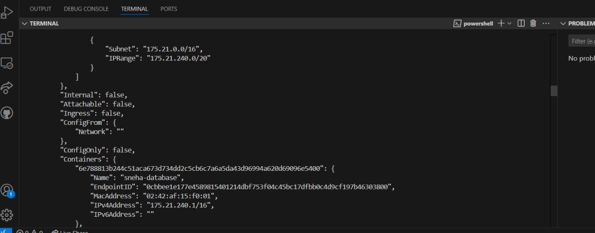

# 🚀 Docker Bridge: Balancing Isolation & Connectivity

## 📌 Objective

The goal of this exercise is to explore and demonstrate **network isolation** in Docker containers. We will examine how containers within the same **custom bridge network** can communicate, while those on different networks remain **isolated**. Understanding this is crucial for securing microservices and containerized applications.

---

## 🌐 Introduction to Docker Networking

Docker networking is fundamental for **containerized applications**, allowing containers to communicate while ensuring **security and isolation**. Docker provides several networking options:

### 🔹 Types of Docker Networks:

- **Bridge Network (Default)** – Allows communication between containers using internal IPs unless restricted.
- **Custom Bridge Network** – Offers better control and supports name-based resolution.
- **Host Network** – Attaches containers directly to the host’s network stack.
- **Overlay Network** – Enables communication across multiple hosts (Docker Swarm).
- **Macvlan Network** – Assigns a MAC address to each container, making them appear as separate devices.
- **None Network** – Completely disables networking.

For this demonstration, we focus on the **custom bridge network**, which improves control and **network isolation**.

---

## ⚡ Why Use a Custom Bridge Network?

<<<<<<< HEAD:DockSpace-main/DockeRNetworkIsolation/Readme.md
A **custom bridge network** offers several advantages: ✅ **Improved Security** – Containers on different networks are isolated by default. ✅ **Better Performance** – Direct communication without host networking stack overhead. ✅ **DNS-Based Resolution** – Containers communicate via names instead of IPs. ✅ **Greater Control** – Define specific **subnets, IP ranges, and gateways**.

To demonstrate, we create a **custom bridge network** called `sneha-bridge` and connect multiple containers.
=======
To demonstrate, we create a **custom bridge network** called `Sneha-bridge` and connect multiple containers.
>>>>>>> 09ddb14 (docker's work):DockSpace-main/6. Docker Bridge_ Balancing Isolation & Connectivity/readme.md

---

## 🔧 1. Creating a Custom Bridge Network

```bash
<<<<<<< HEAD:DockSpace-main/DockeRNetworkIsolation/Readme.md
docker network create --driver bridge --subnet 172.20.0.0/16 --ip-range 172.20.240.0/20 sneha-bridge
=======
docker network create --driver bridge --subnet 172.20.0.0/16 --ip-range 172.20.240.0/20 Sneha-bridge
>>>>>>> 09ddb14 (docker's work):DockSpace-main/6. Docker Bridge_ Balancing Isolation & Connectivity/readme.md
```

### 🔍 Explanation:

- `--driver bridge` → Uses the default **bridge network mode**.
- `--subnet 172.20.0.0/16` → Defines the network’s **IP range**.
- `--ip-range 172.20.240.0/20` → Allocates IPs **dynamically**.

---

## 🚀 2. Running Containers in the Custom Network
<<<<<<< HEAD:DockSpace-main/DockeRNetworkIsolation/Readme.md

### Running **Redis Container** (`sneha-database`)

```bash
docker run -itd --net=sneha-bridge --name=sneha-database redis
```

### Running **BusyBox Container** (`sneha-server-A`)

```bash
docker run -itd --net=sneha-bridge --name=sneha-server-A busybox
=======
### Running **Redis Container** (`Sneha-database`)
```bash
docker run -itd --net=Sneha-bridge --name=Sneha-database redis
```
### Running **BusyBox Container** (`Sneha-server-A`)
```bash
docker run -itd --net=Sneha-bridge --name=Sneha-server-A busybox
>>>>>>> 09ddb14 (docker's work):DockSpace-main/6. Docker Bridge_ Balancing Isolation & Connectivity/readme.md
```

### 📌 Check Container IPs

```bash
<<<<<<< HEAD:DockSpace-main/DockeRNetworkIsolation/Readme.md
docker network inspect sneha-bridge
=======
docker network inspect Sneha-bridge
>>>>>>> 09ddb14 (docker's work):DockSpace-main/6. Docker Bridge_ Balancing Isolation & Connectivity/readme.md
```

Expected Output:

```
<<<<<<< HEAD:DockSpace-main/DockeRNetworkIsolation/Readme.md
 sneha-database: 172.20.240.1
 sneha-server-A: 172.20.240.2
=======
 Sneha-database: 172.20.240.1
 Sneha-server-A: 172.20.240.2
>>>>>>> 09ddb14 (docker's work):DockSpace-main/6. Docker Bridge_ Balancing Isolation & Connectivity/readme.md
```

---

<<<<<<< HEAD:DockSpace-main/DockeRNetworkIsolation/Readme.md
## 🗄 3. Testing Communication Between Containers

### Ping from **sneha-database** to **sneha-server-A**

```bash
docker exec -it sneha-database ping 172.20.240.2
```

### Ping from **sneha-server-A** to **sneha-database**

```bash

docker exec -it sneha-server-A ping 172.20.240.1
=======
## 📔 3. Testing Communication Between Containers
### Ping from **Sneha-database** to **Sneha-server-A**
```bash
docker exec -it Sneha-database ping 172.20.240.2
```
### Ping from **Sneha-server-A** to **Sneha-database**
```bash
docker exec -it Sneha-server-A ping 172.20.240.1
>>>>>>> 09ddb14 (docker's work):DockSpace-main/6. Docker Bridge_ Balancing Isolation & Connectivity/readme.md
```



✅ Expected Outcome: Both containers should successfully **ping** each other.

---

## 🚧 4. Demonstrating Network Isolation with a Third Container
<<<<<<< HEAD:DockSpace-main/DockeRNetworkIsolation/Readme.md

We add another container (`sneha-server-B`) on the **default bridge network**.

```bash
docker run -itd --name=sneha-server-B busybox
```

### 📌 Get IP of `sneha-server-B`

```bash
docker inspect -format='{{range .NetworkSettings.Networks}}{{.IPAddress}}{{end}}' sneha-server-B
=======
We add another container (`Sneha-server-B`) on the **default bridge network**.
```bash
docker run -itd --name=Sneha-server-B busybox
```
### 📌 Get IP of `Sneha-server-B`
```bash
docker inspect -format='{{range .NetworkSettings.Networks}}{{.IPAddress}}{{end}}' Sneha-server-B
>>>>>>> 09ddb14 (docker's work):DockSpace-main/6. Docker Bridge_ Balancing Isolation & Connectivity/readme.md
```

(Example IP: `172.17.0.2`)

---

## ❌ 5. Testing Communication Between Different Networks
<<<<<<< HEAD:DockSpace-main/DockeRNetworkIsolation/Readme.md

Ping from `sneha-database` to `sneha-server-B`:

```bash
docker exec -it sneha-database ping 172.17.0.2
=======
Ping from `Sneha-database` to `Sneha-server-B`:
```bash
docker exec -it Sneha-database ping 172.17.0.2
>>>>>>> 09ddb14 (docker's work):DockSpace-main/6. Docker Bridge_ Balancing Isolation & Connectivity/readme.md
```

🚨 **Expected Outcome:** The ping should **fail**, as they are on different networks.

---

## 🔍 6. Confirming Network Isolation

### Inspect Networks

```bash
<<<<<<< HEAD:DockSpace-main/DockeRNetworkIsolation/Readme.md
docker network inspect sneha-bridge
docker network inspect bridge
```

✅ `sneha-bridge` should contain `sneha-database` & `sneha-server-A`. ✅ `bridge` should contain `sneha-server-B`.
=======
docker network inspect Sneha-bridge
docker network inspect bridge
```
✅ `Sneha-bridge` should contain `Sneha-database` & `Sneha-server-A`.
✅ `bridge` should contain `Sneha-server-B`.
>>>>>>> 09ddb14 (docker's work):DockSpace-main/6. Docker Bridge_ Balancing Isolation & Connectivity/readme.md

---

## 🏆 Conclusion

- **Containers in the same network** can communicate.
- **Containers in different networks** are isolated **by default**.
- Docker’s **networking model** ensures security and separation unless explicitly connected.

🚀 **Now you have mastered Docker Bridge Networking!** 🎯

