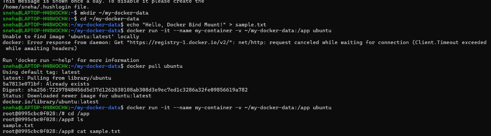
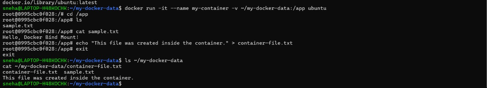

# Docker Bind Mount Example

## Overview
This document provides a professional guide on utilizing Docker Bind Mounts to enable seamless file sharing between a container and the host machine. The accompanying images illustrate the execution of these steps.

## Steps to Reproduce

### 1. Create a Directory and File on the Host
Begin by creating a dedicated directory for data sharing and adding a sample file:
```sh
mkdir ~/my-docker-data
cd ~/my-docker-data
echo "Hello, Docker Bind Mount!" > sample.txt
```
This file will later be accessible from within the container.

### 2. Run a Docker Container with a Bind Mount
Execute the following command to launch a Docker container while mounting the previously created directory:
```sh
docker run -it --name my-container -v ~/my-docker-data:/app ubuntu
```
This command:
- Runs a new interactive Ubuntu container.
- Assigns it the name `my-container`.
- Binds the host directory `~/my-docker-data` to `/app` inside the container.

### 3. Verify the Mounted File Inside the Container
Within the running container, navigate to the `/app` directory and list the files:
```sh
cd /app
ls
cat sample.txt
```
Expected Output:
```
Hello, Docker Bind Mount!
```
This confirms that the file created on the host is accessible inside the container.


### 4. Create a New File Inside the Container
To test bidirectional data sharing, create a new file inside the container:
```sh
echo "This file was created inside the container." > container-file.txt
```
Exit the container:
```sh
exit
```

### 5. Verify the Newly Created File on the Host
After exiting the container, check whether the file created inside the container appears in the host directory:
```sh
ls ~/my-docker-data
cat ~/my-docker-data/container-file.txt
```
Expected Output:
```
This file was created inside the container.
```

This demonstrates that files created in the container are persisted on the host system.


## Conclusion
Docker Bind Mounts provide an efficient way to manage persistent data between a host and a container. This approach is useful for development, debugging, and scenarios where persistent data storage is required. By following these steps, users can effectively share files while maintaining synchronization between the containerized environment and the host machine.


